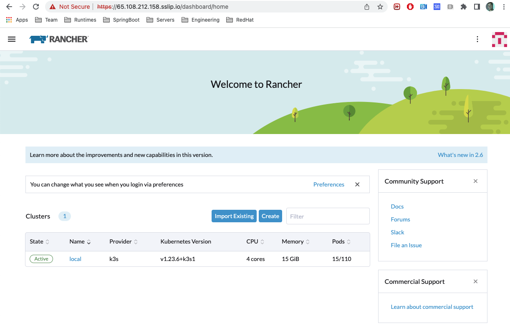
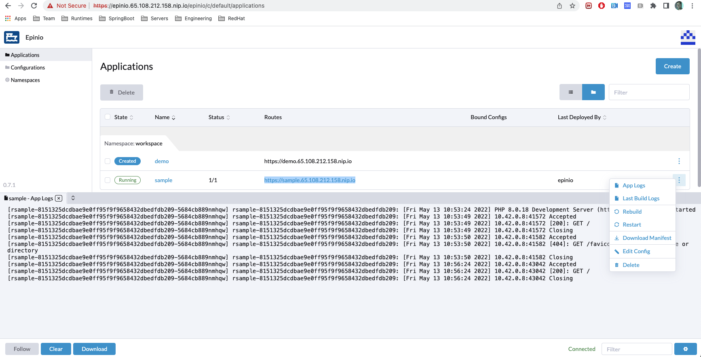

Table of Contents
=================
* [Rancher](#rancher)
* [References](#references)
* [Architecture](#architecture)
* [Install Rancher](#install-rancher)
* [Demo](#demo)
* [Tips](#tips)
* [Cleanup](#cleanup)

# Rancher

See official documentation: https://rancher.com/products/rancher

# References

https://blog.bitforger.dev/installing-rancher-on-k3s-without-public-internet-access
https://www.liquidweb.com/kb/how-to-install-and-configure-rancher-k3s/

# Architecture

The Rancher solution is composed of 2 systems: a rancher or k3s server running a supservisor top of akubernetes cluster
and a k3s agent which is deployed/installed next to each node cluster


# Install Rancher

To install Rancher within a VM, execute the following command:

```bash
curl -sfL https://get.k3s.io | sh -s - server
sudo chmod -R 644 /etc/rancher/k3s/k3s.yaml
k3s kubectl get node
NAME           STATUS   ROLES                  AGE     VERSION
k122-centos7   Ready    control-plane,master   3m26s   v1.23.6+k3s1
```
It will install a linux service to start/stop the k3s server like different tools or scripts:
- k3s client
- kubectl
- crictl
- ctr
- k3s-killall.sh
- k3s-uninstall.sh

**Note**: The kubectl app installed by K3s will automatically use a newly created kubeconfig file written to `/etc/rancher/k3s/k3s.yaml`.

Next, change the permissions to access the k3s kubeconfig file and copy it to `~~.kube/config`
```bash
sudo chmod -R 644 /etc/rancher/k3s/k3s.yaml
cp /etc/rancher/k3s/k3s.yaml ~/.kube/config
```
Install now different packages such as: Certificate manager, Rancher UI, fleet, etc:

```bash
IP=65.108.212.158
RANCHER_ADMIN_PASSWORD=k3s-admin

kubectl create ns cattle-system

kubectl apply -f https://github.com/jetstack/cert-manager/releases/download/v1.5.1/cert-manager.crds.yaml
helm repo add jetstack https://charts.jetstack.io
helm repo update
helm install cert-manager jetstack/cert-manager --namespace cert-manager --create-namespace --version v1.5.1

helm repo add rancher-latest https://releases.rancher.com/server-charts/latest
helm install rancher rancher-latest/rancher \
  --namespace cattle-system \
  --set hostname=$IP.sslip.io \
  --set replicas=1 \
  --set bootstrapPassword=$RANCHER_ADMIN_PASSWORD
```

You can now open the URL of the dashboard to create new clusters using the address: https://<IP>.sslip.io/
and password passed as parameter to the Helm command.



# Demo

The DevExp proposed by Rancher / Suse is designed around the project [Epinio](https://docs.epinio.io/) which supports the concept of the `cf push` but
using a different [client](https://docs.epinio.io/installation#installation) `epinio`. 

An application which is pushed to the platform will be then built using `Paketo Buildpacks`, next deployed and route created

```bash
$ git clone https://github.com/epinio/epinio.git
Cloning into 'epinio'...
remote: Enumerating objects: 22426, done.
remote: Counting objects: 100% (479/479), done.
remote: Compressing objects: 100% (241/241), done.
remote: Total 22426 (delta 259), reused 374 (delta 196), pack-reused 21947
Receiving objects: 100% (22426/22426), 15.78 MiB | 17.99 MiB/s, done.
Resolving deltas: 100% (15509/15509), done.

$ cd epinio/assets/
$ epinio settings update

🚢  Updating the stored credentials from the current cluster
Settings: /home/snowdrop/.config/epinio/settings.yaml

✔️  Ok

$ epinio push --name sample --path sample-app

🚢  About to push an application with the given setup
Manifest: <<Defaults>>
Name: sample
Source Origin: /home/snowdrop/epinio/assets/sample-app
Target Namespace: workspace

⚠️  Hit Enter to continue or Ctrl+C to abort (deployment will continue automatically in 5 seconds)

Create the application resource ...

Collecting the application sources ...

Uploading application code ...

Staging application with code...

🚢  Streaming application logs
Namespace: workspace
Application: sample

🕞  Running staging
🕞  [stage-workspace-sample-547415552f6e292117f6b3ecc116ab3dfd6l7x5q] download-s3-blob By _ _ __ ___ _____ root /aws
download: s3://epinio/da86fa4d-c27b-4e9d-8b85-89a58c05114f to ../workspace/source/da86fa4d-c27b-4e9d-8b85-89a58c05114f KiB/s) with 1 file(s) remaining
🕞  [stage-workspace-sample-547415552f6e292117f6b3ecc116ab3dfd6l7x5q] download-s3-blob _ _ __ ___ _____ Done
🕞  [stage-workspace-sample-547415552f6e292117f6b3ecc116ab3dfd6l7x5q] buildpack By _ _ __ ___ _____ cnb /layers
🕞  [stage-workspace-sample-547415552f6e292117f6b3ecc116ab3dfd6l7x5q] buildpack /workspace
🕞  [stage-workspace-sample-547415552f6e292117f6b3ecc116ab3dfd6l7x5q] buildpack /workspace/cache
🕞  [stage-workspace-sample-547415552f6e292117f6b3ecc116ab3dfd6l7x5q] buildpack /workspace/source
...
Deploying application ...

🕞  Creating application resources
✔️  App is online.
Name: sample
Namespace: workspace
Builder Image:
Routes:
1: https://sample.65.108.212.158.nip.io
```



# Tips

To get the kubeconfig and access it from another machine
```bash
sudo cat /etc/rancher/k3s/k3s.yaml
```

# Cleanup

To uninstall
```bash
/usr/local/bin/k3s-killall.sh
/usr/local/bin/k3s-uninstall.sh
```
